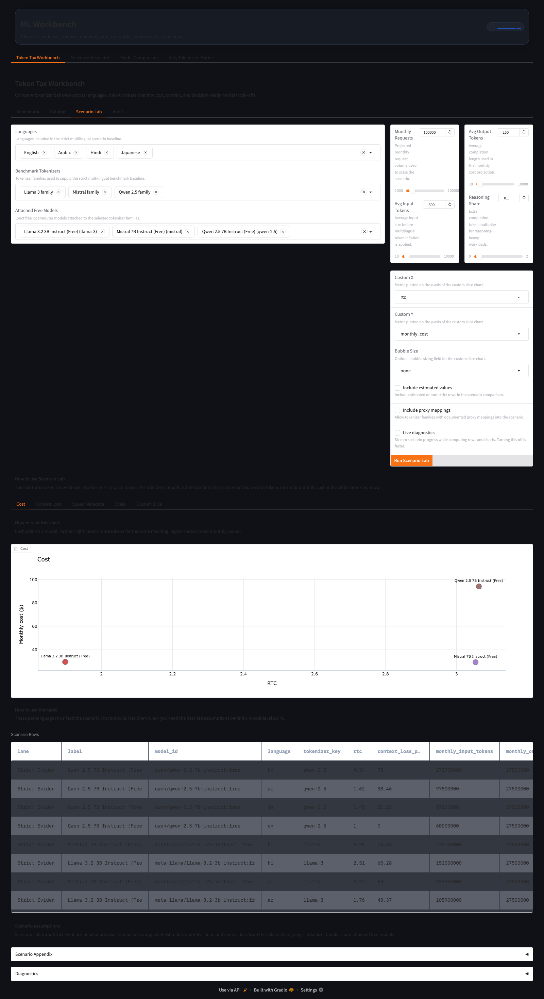
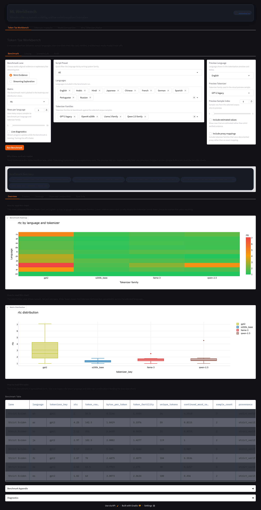
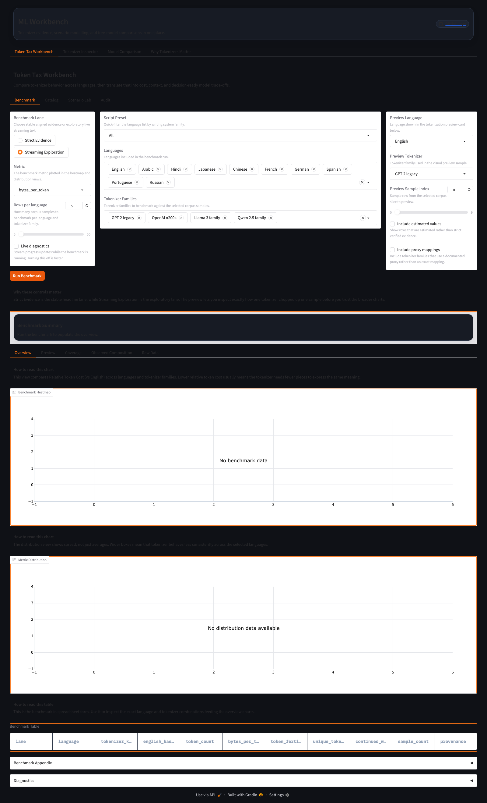
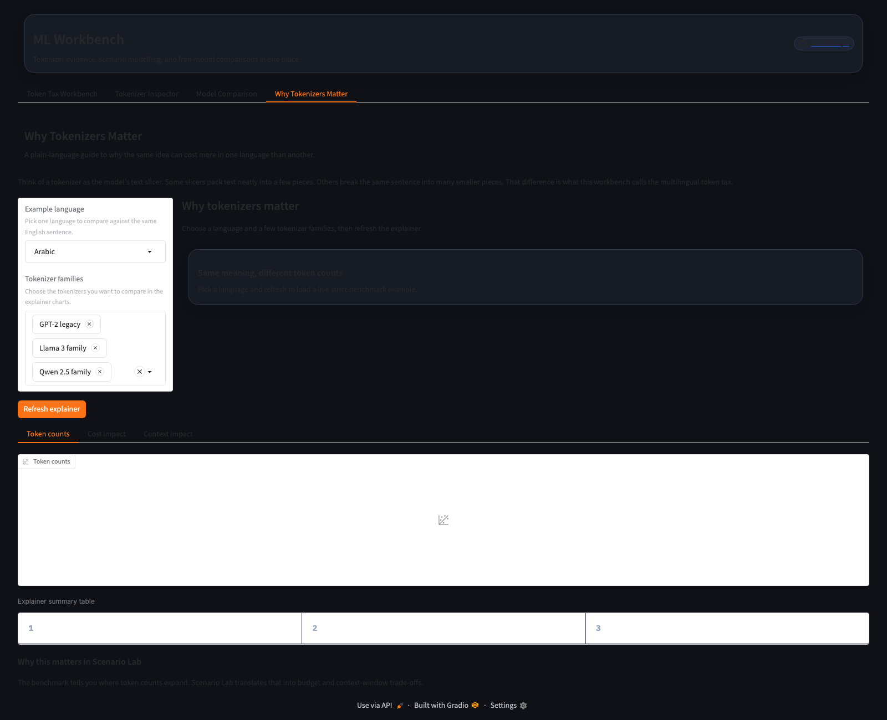

# ML Workbench

Tokenizer evidence for real models, real languages, and real cost trade-offs.

ML Workbench is a portfolio-grade Gradio app for answering one practical question:

> If the same meaning is written in English, Arabic, Hindi, Japanese, or Chinese, how much extra cost and context do different tokenizer families impose?

It combines strict multilingual benchmark evidence, a tokenizer-to-model catalog, scenario modelling, a token inspector, and a plain-language explainer in one app.



## Why This Exists

Most model comparisons treat tokenization as invisible plumbing. It is not.

The same idea can consume very different token counts depending on:
- the language
- the tokenizer family
- the deployable model sitting on top of that tokenizer

That changes three things immediately:
- API cost
- usable context window
- how multilingual traffic scales in production

This repo makes those trade-offs visible instead of assuming one model behaves equally across all languages.

## What The App Does

### Token Tax Workbench
- **Benchmark** compares tokenizer families across languages
- **Catalog** maps tokenizer families to deployable free OpenRouter models
- **Scenario Lab** turns tokenizer evidence into cost and context trade-offs
- **Audit** explains formulas, data sources, and provenance rules

### Tokenizer Inspector
- paste text and see how a tokenizer actually splits it
- inspect token IDs, fragmentation, and language efficiency

### Model Comparison
- compare two free OpenRouter models side by side
- inspect answer quality, reasoning traces, and token usage

### Why Tokenizers Matter
- a non-technical explainer for product, ops, and leadership audiences

## Evidence Model

The app uses two benchmark lanes on purpose.

### Strict Evidence
- default lane
- local committed FLORES snapshot
- aligned multilingual text
- safe to use for deploy-grade cost and context analysis

### Streaming Exploration
- opt-in lane
- live natural-language streaming samples
- more realistic but less controlled
- useful for exploratory tokenizer behavior, not headline scenario estimates

Only **Strict Evidence** feeds Scenario Lab cost and context projections.

## What We Measure

- **Relative Token Cost (vs English)**: how many more tokens a language needs than aligned English for the same meaning
- **Text packed into each token**: UTF-8 bytes per token; higher means a tokenizer packs more raw text into each token
- **Word split rate**: how often a tokenizer breaks words into continuation pieces
- **Tokens per word / character**: a practical proxy for tokenizer fragmentation pressure
- **Unique tokens used**: how broad the observed token coverage is on the selected benchmark rows

## How To Use It

1. Start in **Benchmark**
   - compare tokenizer families across your target languages
2. Move to **Catalog**
   - see which free deployable models sit on top of those families
3. Open **Scenario Lab**
   - test what those token differences mean for monthly cost and context loss
4. Use **Audit**
   - verify formulas, source types, and provenance assumptions

## Methodology And Data

### Benchmark corpus
- strict lane uses a local committed FLORES-derived multilingual snapshot in [`data/strict_parallel/`](data/strict_parallel/)
- streaming lane uses live exploratory text samples

### Runtime model catalog
- model availability comes from the local OpenRouter registry and attached free-model mappings
- only free models are used for hosted runtime comparisons

### Speed metadata
- Artificial Analysis speed data is local snapshot metadata only
- it is supporting context, not the main token-tax evidence

### Mapping policy
- exact tokenizer mappings are visible by default
- proxy mappings are hidden unless the user explicitly enables them

## Technical Architecture

The app is intentionally split into a few clear layers so the data flow stays explainable.

### App shell
- [`app.py`](app.py) builds the top-level Gradio shell
- it mounts four major product surfaces:
  - Token Tax Workbench
  - Tokenizer Inspector
  - Model Comparison
  - Why Tokenizers Matter

### Tokenizer benchmark pipeline
- [`corpora.py`](corpora.py) provides the strict snapshot and the streaming corpus fetch path
- [`tokenizer_registry.py`](tokenizer_registry.py) is the source of truth for tokenizer-family metadata
- [`tokenizer.py`](tokenizer.py) loads and caches tokenizer implementations
- [`token_tax.py`](token_tax.py) computes benchmark rows, raw rows, scenario projections, and appendices
- [`charts.py`](charts.py) turns benchmark and scenario rows into Plotly figures
- [`token_tax_ui.py`](token_tax_ui.py) wires those handlers into Gradio tabs, tables, plots, CSV export, and explanatory copy

### Registry-driven model mapping
- [`model_registry.py`](model_registry.py) maps tokenizer families to free deployable models, pricing, and benchmark-only speed metadata
- Scenario Lab only uses models with acceptable tokenizer provenance for the current policy settings

### Scenario modelling
- Scenario Lab consumes **strict benchmark rows**, not streaming exploration rows
- the scenario flow translates tokenizer inflation into:
  - projected monthly input tokens
  - projected monthly cost
  - estimated context loss

### Hosting model
- primary host: Render
- hosting is stateless
- benchmark persistence comes from repo-tracked snapshots, not runtime disk state

### Docker strategy
- the Docker image warms the default tokenizer set during build so the first request is faster and less memory-spiky on low-resource hosting

## Code Structure

### Core app
- [`app.py`](app.py): Gradio shell and comparison tab
- [`explainer.py`](explainer.py): plain-language explainer tab

### Benchmark + scenario
- [`token_tax.py`](token_tax.py): benchmark/scenario computation
- [`token_tax_ui.py`](token_tax_ui.py): workbench UI composition
- [`charts.py`](charts.py): chart builders

### Registries + data
- [`tokenizer_registry.py`](tokenizer_registry.py): tokenizer family metadata
- [`model_registry.py`](model_registry.py): free model mappings and pricing metadata
- [`corpora.py`](corpora.py): corpus sources and snapshot loading
- [`data/`](data/): committed benchmark and telemetry snapshots

### Verification and tooling
- [`review_harness.py`](review_harness.py): screenshot review harness
- [`scripts/`](scripts/): review, snapshot, and utility scripts
- `test_*.py`: TDD/regression suite

## Quality And Verification

This repo is being set up with portfolio-style quality gates:

- `ruff` for fast linting
- `mypy` on the core Python modules
- `pytest` for regression coverage
- screenshot review harness for visual QA
- smoke import for `build_ui()`

Representative local commands:

```bash
make lint
make typecheck
make test
uv run python -c "from app import build_ui; ui = build_ui(); print(type(ui).__name__)"
```

## Screenshots

### Strict benchmark


### Streaming benchmark


### Scenario Lab


### Explainer


## Run Locally

Requires [uv](https://docs.astral.sh/uv/).

```bash
make install
make run
```

Open the local Gradio URL printed in the terminal.

If you want hosted-style model comparison locally:

```bash
OPENROUTER_API_KEY=sk-or-... make run
```

## Deployment

Render is the primary hosted target.

```bash
make deploy
```

Render auto-deploys from `main`.

## Caveats

- **Streaming Exploration** is exploratory and should not be treated as aligned multilingual RTC evidence
- speed metadata is benchmark-only supporting context
- tokenizer-to-model mappings are intentionally conservative
- hosted runtime comparison is restricted to free models to keep costs controlled

## Docs

Supporting material now lives under [`docs/`](docs/):
- guides
- research/source notes
- operational deployment notes
- archived workflow/project material
